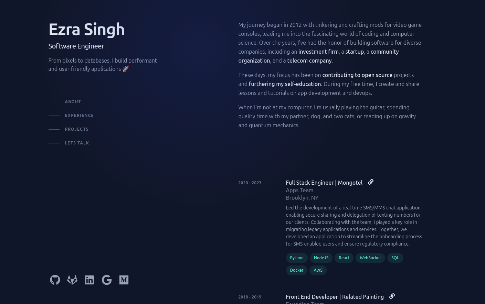

# ezrasingh.dev



## Required

Node v20.11.0
Yarn v1.22.21

> If you have `nvm` try `nvm use` to auto detect from the `.nvmrc` file.

## Getting Started

Install dependencies

```shell
yarn install
```

Run development server @ [port 300](http://localhost:3000/)

```shell
yarn dev
```

Lint code

```shell
yarn lint
```

## Credits

Based on [Brittany Chiang's](https://brittanychiang.com/)  elegant website. Built with [Next.js](https://nextjs.org/) and [TailwindCSS](https://tailwindcss.com/), deployed with [Vercel](https://vercel.com/). All text is set in the [Inter](https://rsms.me/inter/) typeface.